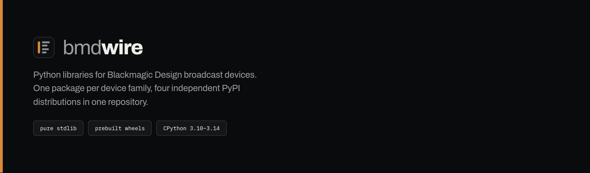

<p align="center"></p>

Python libraries for Blackmagic Design broadcast devices: one package per device family, four independent PyPI distributions in one repository.

[](https://github.com/lucas-romanenko/bmdwire/actions/workflows/ci.yml)

| Package | Install | Purpose | License | Latest | Docs |
|---|---|---|---|---|---|
| **atemwire** | `pip install atemwire` | ATEM switchers: the native UDP protocol, a connection pool, macro bytecode, "Save Switcher State" profiles | LGPL-3.0-only | [](https://github.com/lucas-romanenko/bmdwire/tags) | [atemwire/README.md](atemwire/README.md) |
| **hyperdeckwire** | `pip install hyperdeckwire` | HyperDeck recorders: transport control and clip listing over TCP 9993, clip upload over FTP | MIT | [](https://github.com/lucas-romanenko/bmdwire/tags) | [hyperdeckwire/README.md](hyperdeckwire/README.md) |
| **ultimattewire** | `pip install ultimattewire` | Ultimatte 12 keyers: archive and restore over the native TCP protocol, Smart Remote 4 compatible zips | MIT | [](https://github.com/lucas-romanenko/bmdwire/tags) | [ultimattewire/README.md](ultimattewire/README.md) |
| **videohubwire** | `pip install videohubwire` | Videohub routers: state snapshot, crosspoint routing, labels over TCP 9990 | MIT | [](https://github.com/lucas-romanenko/bmdwire/tags) | [videohubwire/README.md](videohubwire/README.md) |

All four are at 1.0.0. They are pure standard library except atemwire, whose small C extension ships as a prebuilt wheel for Linux, macOS and Windows on CPython 3.10 to 3.14, so installing it needs no compiler.

## atemwire stands on pyatem

**atemwire is a fork of [pyatem](https://git.sr.ht/~martijnbraam/pyatem) by
Martijn Braam and the OpenAtem contributors.** Years of reverse engineering
the ATEM protocol came before any of this, and that work is what made the
rest possible. It branched at upstream commit `8f45831` (2026-03-14) and was
then developed for months against live switchers: transport reliability
fixes, a declarative wire-format layer, corrected and extended message
coverage, macro upload, and profile save and restore.

The licence is unchanged and not negotiable: **LGPL-3.0-only**, the same as
upstream. Improvements to atemwire stay open, as they should. The other three
libraries here were written from scratch and are MIT.

If you want the original rather than this fork, it is at
<https://git.sr.ht/~martijnbraam/pyatem> and it is still maintained.

## Why one repo

The four libraries share an author, a shape and a purpose: they are the device layer of one broadcast control application, extracted and published so others can use them. Keeping them in one repository means one place to file an issue, one CI setup, one release procedure, and a change that spans two device families (a HyperDeck bound to an ATEM, say) is one pull request. They stay four distributions on purpose: each directory is a complete, independently installable project with its own version, license and tests, and `pip install atemwire` never pulls in the other three.

## Development

```sh
git clone https://github.com/lucas-romanenko/bmdwire.git
cd bmdwire/atemwire            # or hyperdeckwire, ultimattewire, videohubwire
pip install -e ".[test]"
python -m pytest
```

Each package is developed from its own directory exactly as before. CI runs the changed package's suite on Python 3.10, 3.12 and 3.14 for every push and pull request. A release is a tag named `<package>-v<version>` (`atemwire-v1.0.0`) whose version matches that package's `pyproject.toml`; the publish workflow builds and uploads that one package.

Not affiliated with or endorsed by Blackmagic Design Pty Ltd. ATEM, HyperDeck, Ultimatte and Videohub are trademarks of Blackmagic Design.
